<div align="center">


### Teman ibadah harianmu

Jadwal sholat · Checklist ibadah · Mushaf bertajwid · Hadits & do'a · Bilal tarawih


</div>

---

**Bilal+** adalah aplikasi Android untuk menemani ibadah sehari-hari: jadwal
sholat sesuai lokasi, pencatatan ibadah harian, Al-Qur'an bertajwid dengan
tampilan mushaf, target khatam, hadits, do'a, dzikir, hingga bacaan bilal
tarawih. Semua catatan tersimpan **di HP pengguna sendiri** - tanpa akun,
tanpa iklan, dan tanpa server.

<p align="center">
  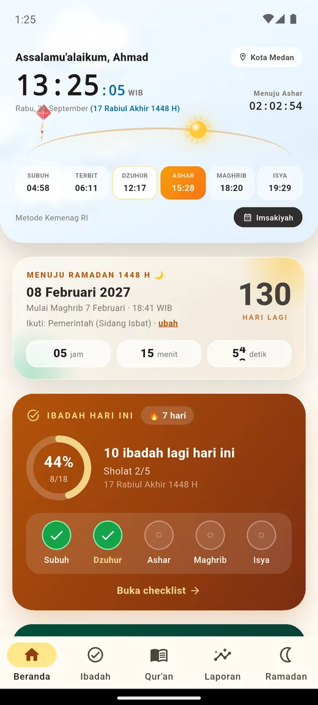
  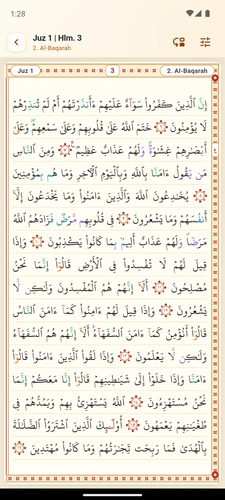
  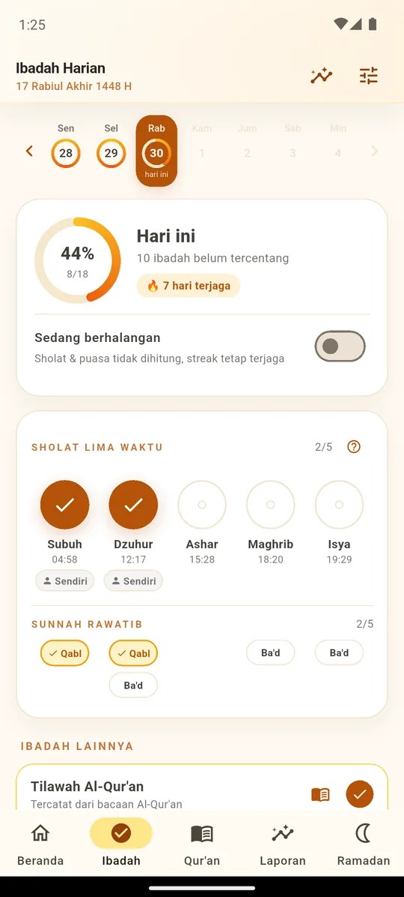
  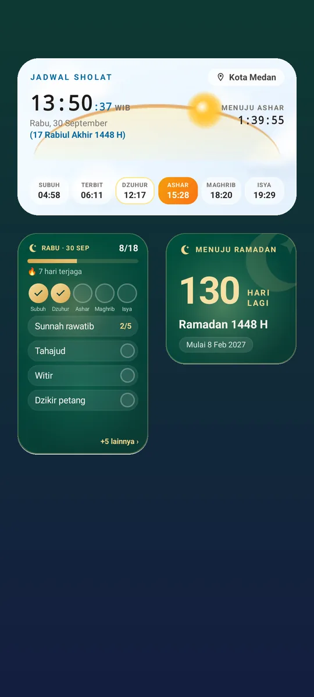
</p>

## Daftar isi

- [Fitur unggulan](#fitur-unggulan)
- [Widget layar utama](#widget-layar-utama)
- [Privasi](#privasi)
- [Teknologi](#teknologi)
- [Menjalankan proyek](#menjalankan-proyek)
- [Struktur proyek](#struktur-proyek)
- [Sumber data](#sumber-data)
- [Catatan rilis](#catatan-rilis)

## Fitur unggulan

### 🕌 Jadwal sholat yang hidup

Kartu jadwal sholat dengan langit yang berubah mengikuti waktu - fajar,
pagi, siang, senja, dan malam dengan bintang serta siluet kota. Saat
Ramadan, Idulfitri, dan Iduladha, kartu otomatis berhias lampion, ketupat,
dan kembang api.

- Waktu sholat dihitung dari lokasi (GPS) atau kota pilihan, metode Kemenag RI
- Notifikasi adzan dengan tombol **"Sudah sholat"** yang langsung mencatat
- Kalender hijriah dengan pilihan metode (Pemerintah, Muhammadiyah, dll.)
  dan penyesuaian tanggal manual
- Hitung mundur Ramadan (mengikuti ketetapan hijriah yang dipilih)

<p align="center">
  
  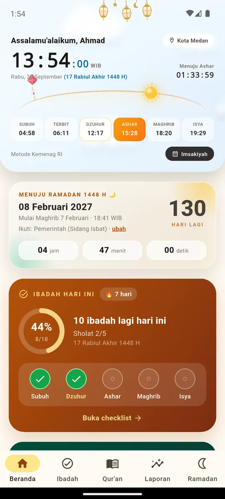
</p>

### ✅ Checklist ibadah harian

- Sholat lima waktu: berjama'ah atau sendiri, jam & tempat sholat, status
  **awal waktu / terlambat / qadha**
- Sunnah rawatib, dhuha, tahajud, witir, dzikir pagi-petang, istighfar,
  sedekah - dan ibadah buatan sendiri
- Ibadah bisa dijadwalkan hanya di **hari tertentu** (mis. Al-Kahfi tiap Jumat)
- Streak, mode berhalangan, rekap Ramadan & hutang puasa qadha
- Pengingat puasa Tarwiyah & Arafah, dan pesan penyemangat yang tidak menghakimi

<p align="center">
  
  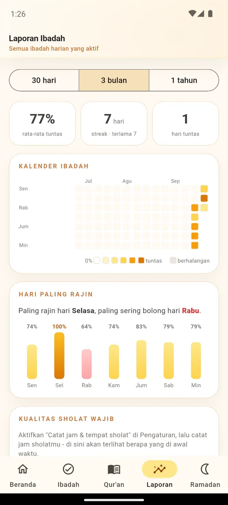
</p>

### 📖 Al-Qur'an bertajwid

- **Mushaf per halaman** (604 halaman) dengan rasm Utsmani Hafs, rata
  kanan-kiri, dan bingkai ornamen seperti mushaf cetak
- **Mode per surah** dengan teks Mushaf Standar Indonesia & terjemahan Kemenag
- **Warna tajwid otomatis** - ghunnah, ikhfa', idgham, iqlab, qalqalah, mad
- **Tanda waqaf berwarna** sesuai hukumnya (م قلى ج صلى لا) dan
  **tanda 'ain** di akhir setiap ruku'
- Pencarian terjemahan dengan sorotan kata, lompat ke surah/ayat/halaman/juz
- Catatan pribadi per ayat, target khatam dengan target baca harian

<p align="center">
  
  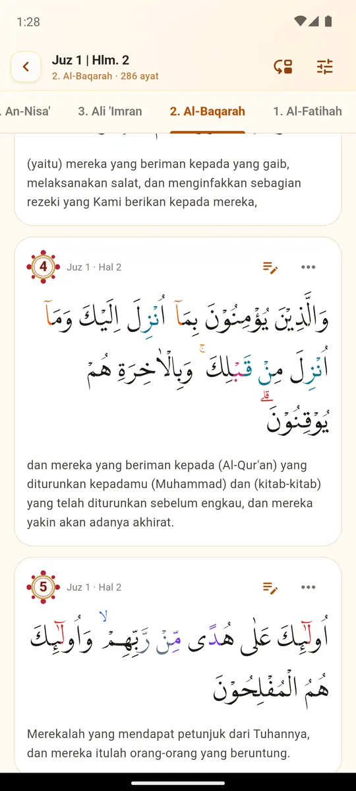
  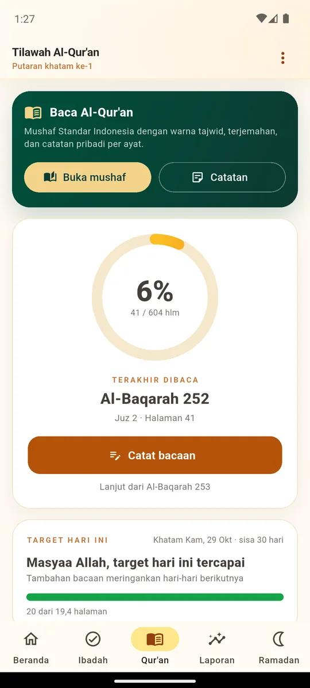
</p>

### 📚 Hadits, do'a & bacaan

- **9 kitab hadits** (±38.000 hadits), diunduh per kitab lalu bisa dibaca
  offline; pencarian lintas kitab
- **Kumpulan do'a** - rujukan hadits di tiap do'a bisa diketuk dan langsung
  membuka haditsnya di aplikasi
- Dzikir pagi-petang (Hisnul Muslim), tasbih digital dengan getar
- Bacaan sholat lengkap per madzhab, **bilal tarawih 11 rakaat**, takbiran,
  Yasin & tahlil, panduan zakat fitrah

<p align="center">
  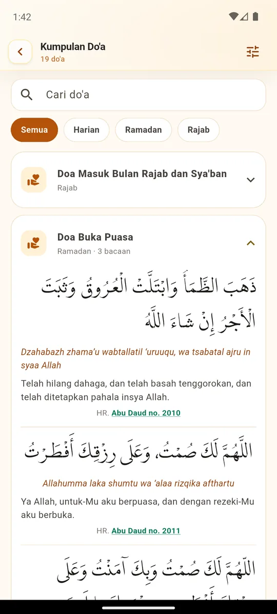
</p>

## Widget layar utama

Lima widget Android yang tetap hidup tanpa membuka aplikasi:

| Widget | Isi |
|---|---|
| **Jadwal Sholat** | Jam berjalan, hitung mundur, langit sesuai waktu, busur matahari |
| **Ibadah Harian** | Checklist lima waktu yang bisa dicentang langsung dari layar utama |
| **Tilawah Al-Qur'an** | Progres khatam, target hari ini, grafik bacaan 7 hari |
| **Semangat Sholat** | Pesan santai sesuai waktu sholat saat ini + lima waktu |
| **Hitung Mundur Ramadan** | Sisa hari menuju Ramadan / hari ke-n Ramadan / Idulfitri |

<p align="center">
  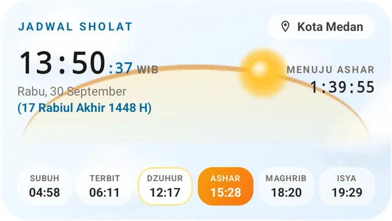
  <br><br>
  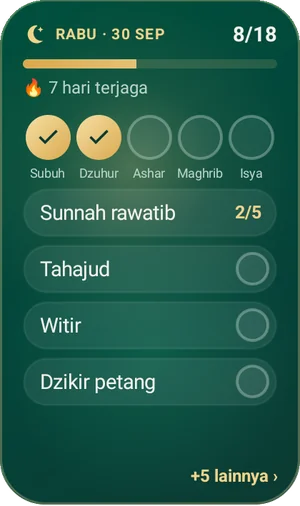
  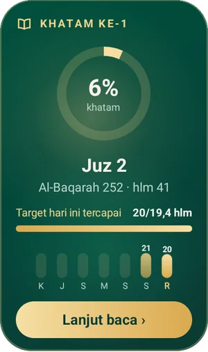
  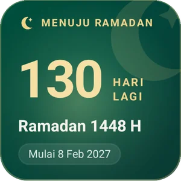
  <br><br>
  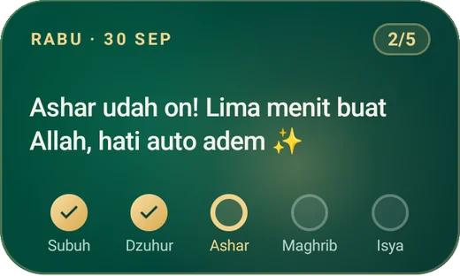
</p>

## Privasi

- **Tanpa akun, tanpa login, tanpa iklan.**
- Catatan ibadah, riwayat tilawah, catatan ayat, dan pengaturan disimpan di
  basis data lokal (SQLite) di HP pengguna - tidak pernah dikirim ke server.
- Lokasi hanya dipakai di HP untuk menghitung waktu sholat.
- Internet hanya dipakai untuk mengunduh pembaruan kalender hijriah dan teks
  kitab hadits yang dipilih - permintaan itu tidak membawa data pribadi.
- Pindah HP lewat berkas cadangan (JSON) yang dibuat & disimpan pengguna sendiri.

## Teknologi

| Bagian | Yang dipakai |
|---|---|
| Aplikasi | Flutter 3.35 · Dart 3.9 |
| Basis data | [drift](https://pub.dev/packages/drift) (SQLite) - catatan ibadah & hadits |
| Waktu sholat | [adhan_dart](https://pub.dev/packages/adhan_dart) · kalender hijriah berjangkar sendiri |
| Widget Android | [home_widget](https://pub.dev/packages/home_widget) + RemoteViews native (Kotlin) |
| Notifikasi | flutter_local_notifications · timezone |
| Lainnya | geolocator · shared_preferences · share_plus · file_picker |

Animasi langit di kartu jadwal sholat digambar dengan `CustomPainter`, lalu
dirender menjadi frame gambar untuk widget layar utama sehingga widget tetap
terlihat hidup tanpa menguras baterai.

## Menjalankan proyek

**Prasyarat:** Flutter 3.35 (Dart 3.9) dan Android SDK.

```bash
# pasang dependensi
flutter pub get

# jalankan di emulator/HP
flutter run

# uji & analisis
flutter test
flutter analyze

# setelah mengubah tabel basis data (drift)
dart run build_runner build --delete-conflicting-outputs
```

**Build rilis.** APK rilis ditandatangani dengan kunci dari
`android/key.properties` (tidak disimpan di repo):

```properties
storePassword=...
keyPassword=...
keyAlias=...
storeFile=/path/ke/upload-keystore.jks
```

```bash
flutter build apk --release
```

Tanpa `key.properties`, build rilis memakai kunci debug.

**Pratinjau suasana hari raya** (build debug saja):

```bash
flutter run --dart-define=SKY_SEASON=ramadan   # atau eid / adha
```

## Struktur proyek

```
lib/
├── data/        data statis: bacaan bilal, dzikir, bacaan sholat, zakat, kota
├── db/          basis data drift (catatan ibadah & hadits)
├── models/      model jadwal sholat
├── pages/       layar aplikasi (beranda, ibadah, Al-Qur'an, laporan, ...)
├── services/    logika: waktu sholat, hijriah, tajwid, notifikasi, widget
├── utils/       utilitas tanggal & animasi
└── widgets/     komponen UI (langit, ornamen, kartu, Al-Qur'an)
android/app/src/main/kotlin/   widget layar utama (RemoteViews native)
assets/          teks Al-Qur'an, do'a, font, logo, kitab Yasin
tool/            skrip pembuat data (Al-Qur'an, ruku', bacaan)
test/            uji unit & widget
```

## Sumber data

- Teks Al-Qur'an Mushaf Standar Indonesia & terjemahan Kemenag RI
- Rasm Utsmani & font KFGQPC Uthmanic Script Hafs (King Fahd Complex)
- Data juz, halaman, dan ruku' dari [Tanzil](https://tanzil.net) (CC BY 3.0)
- Font Arab LPMQ Isep Misbah (Lajnah Pentashihan Mushaf Al-Qur'an Kemenag RI)
- Dzikir dari Hisnul Muslim
- Teks hadits 9 kitab & bacaan bilal tarawih dari server web Bilal Tarawih

> Untuk kebenaran & derajat hadits, tetap dianjurkan bertanya kepada ustadz
> yang kompeten. Warna tajwid dihitung otomatis dan ditujukan sebagai alat
> bantu belajar - tetap dampingi dengan guru.

## Catatan rilis

Riwayat perubahan tiap versi ada di [CHANGELOG.md](CHANGELOG.md).
